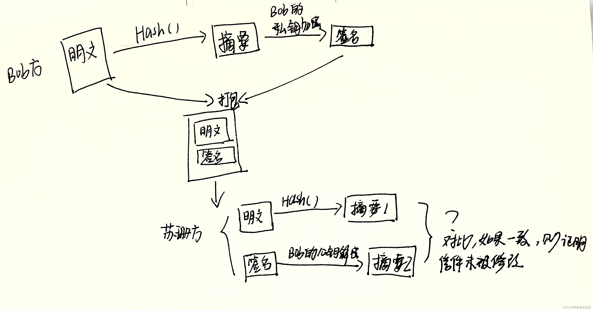

## 哈希函数的几个重要性质
#### collision resistance（哈希碰撞）
例如x≠y H(x)=H(y) 两个不同的输入，输出却是相等的，这就称哈希碰撞。它是不可避免的，因为输入空间总大于输出空间。给出x，很难找到y，除非蛮力求解(brute-force)。
#### hidding（单向的，不可逆）
前提是输入空间非常大，分布均匀。如果不是足够大， 可以自爱后面拼接一个随机数  
如H(x||nonce)。
#### puzzle friendly
指计算出的哈希值是不可预测的。比如用H(x||nonce)计算出的哈希值是以0000开头的一串字符，我们事先无法知道nonce是多少才能算出这个结果，所以只能穷举nonce

## 公钥和私钥
属于非对称加密技术  
#### 信息加密传输：公钥加密，私钥解密
比如我要传消息给B，那么就用B的公钥来加密消息，B收到加密后的消息用自己的私钥解密即可

**为什么不用我的私钥加密消息传给B，B再用我的公钥来解密消息呢？**  
因为我的公钥是公开的，黑客截获消息后可以用我的公钥来解密消息。

#### 身份验证（签名）：私钥加密， 公钥解密
**我要发送消息给B，B怎么知道是我发送的，且中途没有被篡改呢？**  
我用自己的私钥加密消息，B用我的公钥解密消息，如果解密成功则可确认是我发的消息。  

**为什么不用我的公钥加密，B用我的私钥解密呢？**  
因为我的公钥是公开的，黑客可以修改信息，用我的公钥重新生成签名，达到篡改的目的。  

实际的应用场景要比这个复杂，相见之后的段落

## 哈希函数和数字签名

#### 哈希函数
Addr = H（key）

#### 数字签名
数字签名是哈希函数的一大应用。  
利用哈系函数可以将任意长度的输入经由散列函数算法变成固定长度的输出，该输出的哈希值就是消息摘呀奥，也称数字摘要。  

流程：

  
