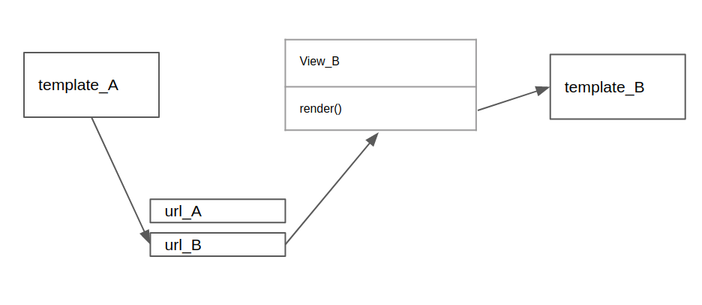

## ORM如何查询字段的值？
```
server_type = Server.objects.filter(id=server_id).values_list('project_type', flat=True)

如上，表示在Server表中查询指定id的server,返回指定的字段（project_type）
flat=True返回单个值： <QuerySet [u'can_picking']>
flat=False返回一个元组列表： <QuerySet [(u'can_picking',)]>
```
## ORM查询字段的值，如果字段是变量该如何处理？
[ 描述 ]  
```
如下：
table = Person or Schedule
result = table.objects.filter(
    name="ly",
)
其中table可能是Person表，也可能是Schedule表。
其中只有Person表有name字段，如何让字段用变量来表示呢？

```  
[ 解决方案 ]  
```
table = Person [or Schedule]
result = table.objects.filter(**{
    variable + '__exact' : 'liyang',
    ...
})
```

## 如何反向引用带下划线的表？
```
class TheClass:
    class Meta:
        managed = False
        db_table = 'the_class'

class TheStudent:
    class Meta:
        db_table = 'the_student'

如上的一对多关系，开始反向查询（查询特定班级有哪些学生）：
TheClass.object.get(id=1).thestudent_set.all()

结论：神tm下划线要去掉，但是，暂不清楚这个属性（thestudent）是用db_table还是用的小写类名。。。
```
## Django有没有类似于flask的g对象呢？
```
可以用request.session来实现
比如：request.session['sever_id'] = server_id

注意：session在各个标签之间共享的，如果标签1需要server_id_1，标签2需要server_id_2，则会出问题
```
## Django中STATIC_URL、STATIC_ROOT、STATICFILES_DIRS 的区别关系
```
1. STATIC_URL

STATIC_URL = '/static/'

在浏览器中访问django的静态文件时的url，比如：
http://localhost:8000/static/img.png

-------

2. STATIC_ROOT

STATIC_ROOT = os.path.join(BASE_DIR, 'static')

当部署项目时,在终端输入:
python manage.py collectstatic
django会把所有的static文件都复制到STATIC_ROOT指定的文件夹下

-------

3. STATICFILES_DIRS

STATICFILES_DIRS =  (os.path.join(BASE_DIR, 'common_static'),)

静态文件的一般安放位置有两种:
1.  一种就是在每个app里面新建一个static文件夹,将静态文件放到里面,在加载静态文件时,
比如要在模板中用到静态文件,django会自动在每个app里面搜索static文件夹
2.  另一种,就是在所有的app文件外面,建立一个公共的文件夹, 这时候就是STATICFILES_DIRS发挥作用了。

STATICFILES_DIRS告诉django,首先到STATICFILES_DIRS里面寻找静态文件,其次再到各个app的static文件夹里面找
(注意, django查找静态文件是惰性查找,查找到第一个,就停止查找了)
```
## render 模板的时候报错：TemplateDoesNotExist: homepage/templates/index.html
[ 描述 ]  
```
return render(request,'homepage/templates/index.html')
```
[ 分析 ]  
可能的原因：  
1. 没有在`INSTALL_APP`里面加入APP  

> 项目settings.py文件中的 TEMPLATES配置项描述了 Django 如何载入和渲染模板。
默认的设置文件设置了 DjangoTemplates 后端作为模板引擎，并将 APP_DIRS设置成了 True。
这一选项将会让 DjangoTemplates 在每个 INSTALLED_APPS 文件夹中寻找 "templates" 子目录。

[ 解决方案 ]  
```
配置好INSTALL_APP后：
return render(request,'index.html')
```
## render静态模板的时候，不同app之间同名的静态文件产生冲突
详见：[link](https://blog.csdn.net/qq_41714308/article/details/104979694)

## Django 使用ajax后，不能让后端进行重定向？

ajax只能请求数据，不能识别后端回复的重定向。

参考：[link](https://www.jianshu.com/p/4dc63638acab)

## 如何实现页面之间的跳转？


## 服务器异步任务执行完毕之后，前端如何获得服务器的回复呢？

## django orm 聚合统计
数据库里面有很多barcode，其中有重复的barcode  
现在要统计这些barcode出现的频次
```
fail_sku_info_datas = BatchFailSkuInfo.objects.filter(batch_id__in=batch_id_list)
datas = fail_sku_info_datas.values('sku_barcode')\
    .annotate(Count('sku_barcode'))\
    .order_by('-sku_barcode__count')
for data in datas:
    print(data)
```
结果：  
```
{u'sku_barcode': u'OLY2009006', u'sku_barcode__count': 2396}
{u'sku_barcode': u'6972541590477', u'sku_barcode__count': 350}
{u'sku_barcode': u'OLY2007005', u'sku_barcode__count': 168}
{u'sku_barcode': u'6972541590200', u'sku_barcode__count': 80}
{u'sku_barcode': u'OLZ2007020', u'sku_barcode__count': 48}
...
...
```

## 用django返回视频流，客户端中途关闭视频，django报错：error: [Errno 104] Connection reset by peer，如何处理？
