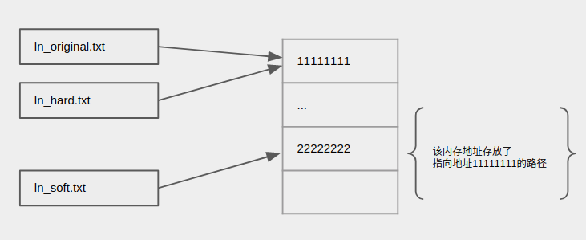
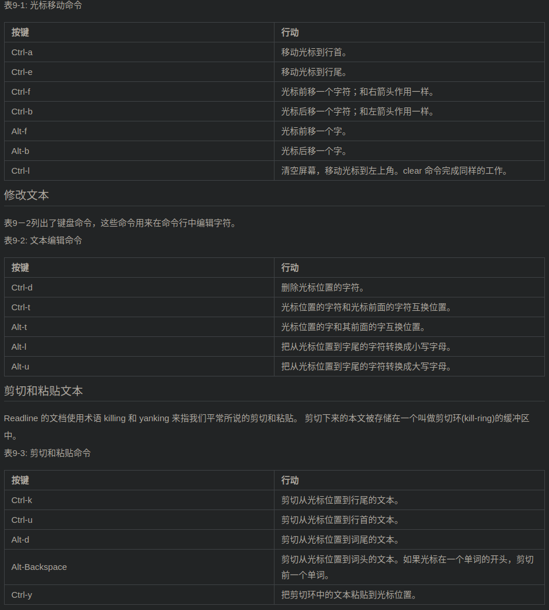

## 文件操作
#### 通配符
```
通配符	                意义
*	        匹配任意多个字符（包括零个或一个）
?	        匹配任意一个字符（不包括零个）
[characters]	匹配任意一个属于字符集中的字符
[!characters]	匹配任意一个不是字符集中的字符
[[:class:]]	匹配任意一个属于指定字符类中的字符


表5-2: 普遍使用的字符类
字符类	                意义
[:alnum:]	匹配任意一个字母或数字
[:alpha:]	匹配任意一个字母
[:digit:]	匹配任意一个数字
[:lower:]	匹配任意一个小写字母
[:upper]	匹配任意一个大写字母

借助通配符，为文件名构建非常复杂的选择标准成为可能。下面是一些类型匹配的范例:
表5-3: 通配符范例
模式	                        匹配对象
*	                所有文件
g*	                文件名以“g”开头的文件
b*.txt	                以"b"开头，中间有零个或任意多个字符，并以".txt"结尾的文件
Data???	                以“Data”开头，其后紧接着3个字符的文件
[abc]*	                文件名以"a","b",或"c"开头的文件
BACKUP.[0-9][0-9][0-9]	以"BACKUP."开头，并紧接着3个数字的文件
[[:upper:]]*	        以大写字母开头的文件
[![:digit:]]*	        不以数字开头的文件
*[[:lower:]123]	        文件名以小写字母结尾，或以 “1”，“2”，或 “3” 结尾的文件
```
#### ln 创建链接


- 硬链接：和源文件没有任何区别,都指向同一块内存
    1. 删除ln_original，也不会影响ln_hard。  
    2. 硬链接不能跨越物理设备
    3. 硬链接不能关联目录，只能是文件
- 软链接（符号链接）：指向另一个内存地址，该内存地址存放了源文件的路径。
    1. 删除ln_soft，不影响ln_original
    2. 如果删除ln_original，ln_soft指向的内存地址中存放的路径会失效。

<br><br><br>

## 重定向
#### \> 和 \>>的区别
- \> ：普通重定向。
- \>>：追加到文本末尾，如果没有文件则创建一个。  

#### 重定向 标准输出和错误 写到文件
[ 描述 ]  
普通的命令 `ls -l > 1.txt` 是把标准输出流到文件。  
如果出现错误则打印到屏幕，如：`ls -l /hello > 1.txt`，这里ls了一个不存在的路径，则报错信息打印到屏幕上。  
使用环境描述符： 0-标准输入，1-标准输出，2-错误。  

[ 解决方案 ]
- 只把错误输出到文件：  
    ```
    ls -l /bin/usr 2> ls-error.txt
    ```
- 把标准输出和错误一起写到文件  
    ```
    ls -l /bin/usr > ls-output.txt 2>&1
    $1指描述符1（标准输出）
    ```
    或者  
    `ls -l /bin/usr &> ls-output.txt`
#### 管道
从标准输出读取数据，再把数据送到标准输入。

<br><br><br>

## 高级键盘操作
#### 命令行编辑

#### 历史记录
```
Ctrl-p	移动到上一个历史条目。类似于上箭头按键。
Ctrl-n	移动到下一个历史条目。类似于下箭头按键。
Alt-<	移动到历史列表开头。
Alt->	移动到历史列表结尾，即当前命令行。
```

<br><br><br>

## 进程
#### 守护进程是什么？
1. Daemon程序是一直运行的服务端程序，又称为守护进程。  
2. 通常在系统后台运行，没有控制终端不与前台交互，Daemon程序一般作为系统服务使用。  
3. Daemon是长时间运行的进程，通常在系统启动后就运行，在系统关闭时才结束。

#### 如何结束进程
```
kill [-signal] pid ...
```
|编号|名字|含义|  
|----|----|---------------------------------------------------|
|1|HUP|挂起|
|2|INT|中断（相当于ctrl+c）|
|9|KILL|杀死（由内核终止这个进程，这个进程没有机会做清理善后工作，直接死亡）|

<br><br><br>

## shell环境
#### 登录 shell 会话的启动文件
```
/etc/profile	
~/.bash_profile	
~/.bash_login	
~/.profile
```
#### 非登录
```
/etc/bash.bashrc
~/.bashrc
```
