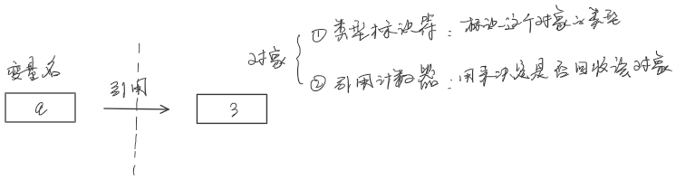
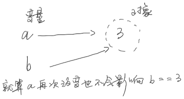
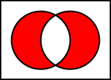

## Python的内置对象类型

数字、字符串、列表、字典、元祖、文件、集合


## 数字、字符串、列表、字典、元祖、文件、集合

```
例：40 + 3.14
Python首先将被操作的对象转换成其中最复杂的操作对象的类型，复杂度排序：
	整数 < 浮点数 < 复数
因此上述运算结果是：浮点数
```


## 变量、对象和引用
1. 当我们执行语句 a = 3 的时候发生了什么？
    ```
    1. 创建一个对象来代表值3（分配了一块内存）
    2. 创建一个变量a
    3. 将变量与新的对象3相连接
    ```



2. 当我们执行语句 a = 3 , b = a 的时候发生了什么？




## 理解对象的可变性和不可变性

- 不可变类型：
    ```
    数字、字符串、元祖

    不可变的意思是不能在原地修改一个字符串，例如：
    S = 'spam'
    s[0] = 'x'

    这样是会报错的
    ```
- 可变类型：
    ```
    列表、字典
    ```


## 需要注意的表达式操作符

| x \| y | 位或，集合并集     |
| ------ | ------------------ |
| X ^ y  | 位异或，集合对称差 |
| X & y  | 位与，集合交集     |
| ~x     | 按位求补（取反）   |
| x ** y | 幂运算             |

**理解集合的差：**

集合 A 和 B 的对称差通表示为AΔB。例如：集合 {1,2,3} 和 {3,4} 的对称差为 {1,2,4}。

- 用图来表示，红色部分表示对称差  



## 对象的属性操作

1. 设置对象的属性：
    ```
    setattr(object,  name, value)  
    ```


2. 判断对象是否有该属性：
    ```
    1. hasattr(object,  name)
    2. 'name' in dir(Object)
    ```
