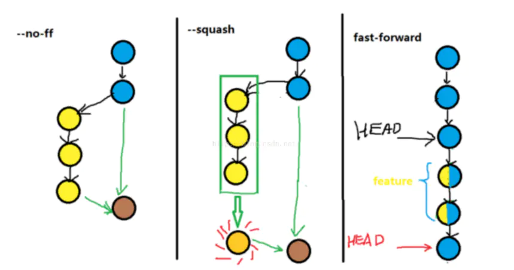

## 远端branch已经删除，而本地还有，该如何处理？  
1. `git remote show origin` ： 用于查看远端和本地branch的差异
2. `git remote prune origin` ： 消除差异
3. 最后再手动删除本地***多余分支***

## 如何撤销push的commit，并回退？  
1. `git log`  
2. `git reset --soft [hash]`  
3. `git push origin [branch] --force`  
    // 本地版本应该==远程版本，如果本地版本\<远程版本，则可以用用`--force`覆盖掉远程的高版本

这样就覆盖掉上次push的commit了

## Git指定远程仓库
git可以管理多个远程仓库，github是其中一个远程仓库，其他的还有例如JIRA。

## HEAD detached at xxx 的解决方案
[ 描述 ]
1. 一直用的github远程仓库，现在新加了一个jira的远程仓库，名字命名为jira。
    ```
    master
    nightly
    remotes/jira/master
    remotes/jira/nightly
    remotes/origin/HEAD -> origin/master
    remotes/origin/master
    remotes/origin/nightly
    ```  
    **注意此时HEAD指向远程服务器的origin/master分支**
2. 当我切换到jira的master分支时出现HEAD detached at xxx的问题  
  
[ 分析 ]
  > 因为HEAD不能指向远程分支，它只能指向本地的某个commit或者本地分支。当"git checkout 远程分支"，而本地又没有这个分支，HEAD就会直接指向远程分支指向的commit了  

[ 解决方案 ]  
1. `git checkout -b xxx` 新建一个新的分支即可，push的时候push到远程分支即可（需要名字一样）

## 如何清空所有的commit，只保留一个commit？
1. 基于现在的分支新建一个分支。新建的分支没有父级结点，它是一个新的根记录，不与其他任何分支和提交记录有连接。
    ```
    git checkout --orphan  new_branch
    ```
2. `git add .` 或者 `git add -A`  
3. `git commit -m xxx`  
4. `git branch -D master`  
5. `git branch -m master  //重命名new_branch为master`  
6. `git push -f origin master`

## 如何处理Untracked files？
[ 描述 ]  
> 新增了几个文件，后来发现不需要这些文件，想删除它们，使用`git checkout -- .`却不能回退（文件依然存在）  

[ 解决方案 ]  
```
git clean -nf  //-n是先确认删除的文件，-f是删除文件，-d是删除目录
```
## 每次push、pull都要求输入密码？
```
1.在~/.gitconfig目录下多出一个文件，用来记录你的密码和帐号	
    git config --global credential.helper store
2.再最后输入一次正确的用户名和密码，就可以成功的记录下来，这是最后一次麻烦啦！
    git pull
```

## push的时候出现错误：fatal: The current branch test_branch has no upstream branch.
[ 原因 ]  
```
本地新增了branch，导致与远程分支没有建立关联接
```
[ 解决方案 ]  
```
git push --set-upstream origin new_branch
```

## git如何重命名分支？
```
一：本地分支重命名
语法：git branch -m old new
git branch -m xxx yyy：将名字为xxx的分支重命名为yyy

二：远程分支重命名
1、将远程分支删除掉
2、将本地分支重命名
3、将本地分支推到远程

比如：将远程的dev重命名为develop
git push --delete origin dev
git branch -m dev develop
git push origin develop
```

## 添加多个不同的ssh
参考: [link](https://support.atlassian.com/bitbucket-cloud/docs/set-up-additional-ssh-keys/)

## 如何批量删除本地分支？
```
git branch | grep ‘dev*’ | xargs git branch -d
```

## git merge: fast-forwards模式
1. fast-forwards
    ```
    假设现在分支处于master，我们要合并nightly分支的内容：
    $ git merge nightly
    git merge命令默认使用fast-forwards，将直接进行合并，合并后看不出nightly分支的任何记录。
    ```
2. git merge --no-ff 
    ```
    假设现在分支处于master，我们要合并nightly分支的内容：
    $ git merge --no-ff -m "merge nightly" nightly
    在合并的时候创建一个commit记录，会保留nightly的信息。
    ```
3. 区别

      

4. 参考
    https://www.jianshu.com/p/26edea85062d


# commit的时候不想新增记录，该如何操作？
```
git commit --amend

这样会在上一条记录上进行修改
```